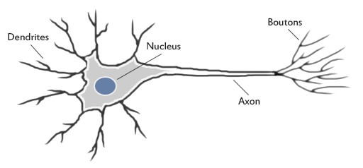
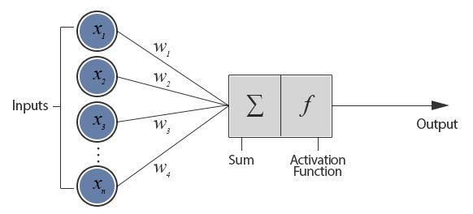

## Neural Network for beginners   
##### Stuff I wish people told me.

---

##  What are these Neural Networks everyone's talking about?

---

---

---

## Why are they cool?

--- 

## Software 2.0

---

## How would you add two numbers?

---

## With a Neural Network?

---

## Wait what...

---

## How would you subtract two numbers?

---

## With a Neural Network?

---

## Multiply?

---

## Divide?

---

## Find percentages?

---

## The answer to life, the universe and everything?

---

## Must definitely be new right?

---

## Demo

---

## Source Material
https://colab.research.google.com/drive/1X9OAqA9WSOxorJrgNVKiHOmh6zJC_ehu

---

Questions?

---
